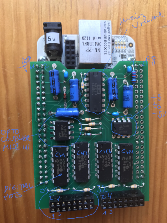

Audio Mixer and Volume MIDI controlled
======================================

This is a simple audio mixer with 4 analog stereo inputs and 1 output. The main volume 
and the volume of each input is controlled by MIDI messages.

The main volume is handled by the PGA2311 chip. The level of the 4 inputs are controlled by the
digital potentiometer MCP4251.

All the components are controlled by a Beaglebone White.

The midi interface is a classical one -not USB- with optocoupler 6N138.

The midi messages are handled in the PRU (Programmable Realtime Unit) of the Beaglebone.

No need to install capes or device tree overlays.

If you don't have a midi controller, the levels can be controlled from a web page too. In that case, an ethernet connection is needed.

Although the analog and digital power supply and grounds are separated in the design, they can be connected together with a jumper. So, the power from the BeagleBone will supply all the circuit. In my case, the results are good enough with the jumpers.

J1 pinout
---------

    1  Left CH1
    2  Left CH1 GND  
    3  Right CH1
    4  Right CH1 GND
    5  Left CH2 GND
    6  Left CH2
    7  Right CH2 GND
    8  Right CH2
    9  Left CH3
    10 Left CH3 GND
    11 Right CH3
    12 Right CH3 GND
    13 Left CH4 GND
    14 Left CH4
    15 Right CH4 GND
    16 Right CH4

J2 pinout
---------

    1  Left out
    2  Left out GND
    3  Right out
    4  Right out GND
    5  Midi in (optocoupler)
    6  NC
    7  Midi in (R220)
    8  NC
    9  NC
    10 NC
    11 +3.3V
    12 NC
    13 +5V Digital
    14 +5V Analog
    15 Digital GND
    16 Analog GND

Beaglebone pins used
--------------------

    P8_1   GND
    P8_2   GND
    P9_1   GND
    P9_2   GND
    P9_4   VDD_3V3
    P9_8   +5V
    P9_11  gpio0_30  MUTE PGA2311
    P9_12  gpio1_28  ZCEN PGA2311
    P9_13  gpio0_31  CS CH3 MCP4251
    P9_14  gpio1_18  CS CH4 MCP4251
    P9_15  gpio1_16  SHDN CH1 MCP4251
    P9_16  gpio1_19  CS CH2 MCP4251
    P9_17  gpio0_5   CS PGA2311
    P9_21  gpio0_3   SPI DATA OUT PGA2311
    P9_22  gpio0_2   SPI CLK PGA2311
    P9_23  gpio1_17  SHDN CH2 MCP4251
    P9_25  gpio3_21  SHDN CH3 MCP4251
    P9_27  gpio3_19  SHDN CH4 MCP4251
    P9_28  gpio3_17  CS CH1 MCP4251
    P9_29  gpio3_15  SPI DATA OUT MCP4251
    P9_30  gpio3_16  SPI DATA IN MCP4251
    P9_31  gpio3_14  SPI CLK MCP4251
    P9_42  gpio7_7   MIDI IN

MIDI Messages Handled
---------------------

    B0 44 7F  Mute ON Main Volume
    B0 44 00  Mute OFF Main Volume
    BA 46 7F  Mute ON CH1
    BA 46 00  Mute OFF CH1
    BA 47 7F  Mute ON CH2
    BA 47 00  Mute OFF CH2
    BA 48 7F  Mute ON CH3
    BA 48 00  Mute OFF CH3
    BA 49 7F  Mute ON CH4
    BA 49 00  Mute OFF CH4
    B0 07 XX  Main Volume (XX: 00-7F)
    BA 07 XX  CH1 Level (XX: 00-7F)
    BA 4A XX  CH2 Level (XX: 00-7F)
    BA 4B XX  CH3 Level (XX: 00-7F)
    BA 4C XX  CH4 Level (XX: 00-7F)

Versions
--------
    
    python3.7, tornado server 6.2

    debian@bbwmixer:/opt/scripts/tools$ sudo ./version.sh
    git:/opt/scripts/:[1b1122751f7051bd8996f353756ba6ff30e71820]
    eeprom:[A335BONE00A50812BB000078]
    model:[TI_AM335x_BeagleBone]
    dogtag:[BeagleBoard.org Debian Buster Console Image 2020-04-06]
    bootloader:[microSD-(push-button)]:[/dev/mmcblk0]:[U-Boot SPL 2019.04-00002-g07d5700e21 (Mar 06 2020 - 11:24:55 -0600)]:[location: dd MBR]
    bootloader:[microSD-(push-button)]:[/dev/mmcblk0]:[U-Boot 2019.04-00002-g07d5700e21]:[location: dd MBR]
    UBOOT: Booted Device-Tree:[am335x-bone-uboot-univ.dts]
    UBOOT: Loaded Overlay:[AM335X-PRU-RPROC-4-19-TI-00A0]
    kernel:[4.19.94-ti-r73]
    nodejs:[v10.24.0]
    /boot/uEnv.txt Settings:
    uboot_overlay_options:[enable_uboot_overlays=1]
    uboot_overlay_options:[disable_uboot_overlay_emmc=1]
    uboot_overlay_options:[disable_uboot_overlay_video=1]
    uboot_overlay_options:[disable_uboot_overlay_audio=1]
    uboot_overlay_options:[disable_uboot_overlay_wireless=1]
    uboot_overlay_options:[disable_uboot_overlay_adc=1]
    uboot_overlay_options:[uboot_overlay_pru=/lib/firmware/AM335X-PRU-RPROC-4-19-TI-00A0.dtbo]
    uboot_overlay_options:[enable_uboot_cape_universal=1]

Known issues
------------

- Hardware: The channels 3 and 4 SPI return information from the MCP4251 chip are not connected. A wire can be soldered if the SPI return information is needed. This is optional because the returned information is not used currently by the software.
- Software: The state of the mute buttons is not updated when the mixer is started. 
- Software: The response to the volume changes may be a little slow. This is due -I suppose- to the fact that the SPI protocol is implemented with GPIOs instead of the true SPI hardware included in the beaglebone. I tried but could not make it work.
